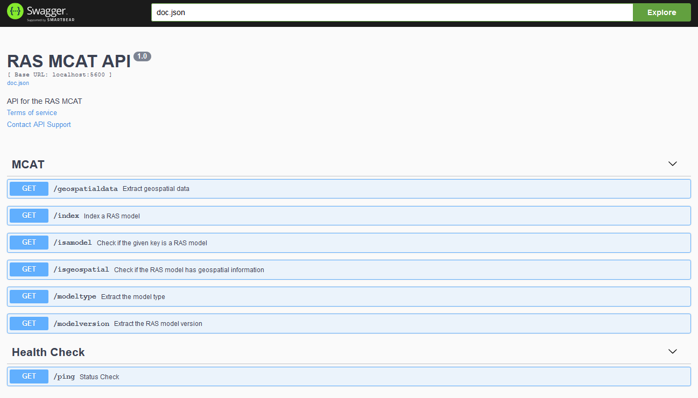

# mcat-ras

Contains the HEC-RAS model content and analysis tool (MCAT). Given a .prj file, this MCAT identifies paths to the plan, forcing, and geometry files and extracts the model's metadata and geospatial data.

The MCAT includes:

- a standard set of methods to evaluate a model's content:
  - isamodel
  - modeltype
  - modelversion
  - index
  - isgeospatial
  - geospatialdata
  - forcingdata
- an API for executing the above methods.
- a docker container for running the methods and API.

## Contents

- `/config`: contains the data structure that holds the config information for the API.
- `/docs`: contains the auto-generated swagger files.
- `/handlers`: contains the handler function for each API endpoint.
- `/tools`: the core code used to extract information from the various HEC-RAS files.
- `docker-compose.yml`: options for building the dockerfile.
- `main.go` : API Server.

### Getting Started

---

- Add a .env file to the root level of this directory with the following structure:
  ```
  AWS_ACCESS_KEY_ID='**************'
  AWS_SECRET_ACCESS_KEY='**************'
  AWS_DEFAULT_REGION='us-east-1'
  S3_BUCKET='******'
  ```
- Run `docker-compose up`
- To teardown, run `docker-compose down`

### MCAT REST Specification

---

The following requests can be used to interrogate a model whose storage location is defined by the s3_key parameter:

`GET /isamodel?definition_file=<s3_key>`

`GET /modeltype?definition_file=<s3_key>`

`GET /modelversion?definition_file=<s3_key>`

`GET /index?definition_file=<s3_key>`

`GET /isgeospatial?definition_file=<s3_key>`

`GET /geospatialdata?definition_file=<s3_key>`

`GET /forcingdata?definition_file=<s3_key>`

_For example: `http://mcat-ras:5600/isamodel?definition_file=models/ras/CHURCH HOUSE GULLY/CHURCH HOUSE GULLY.prj`_

### Swagger Documentation:

---

To view docs goto: http://localhost:5600/swagger/index.html


